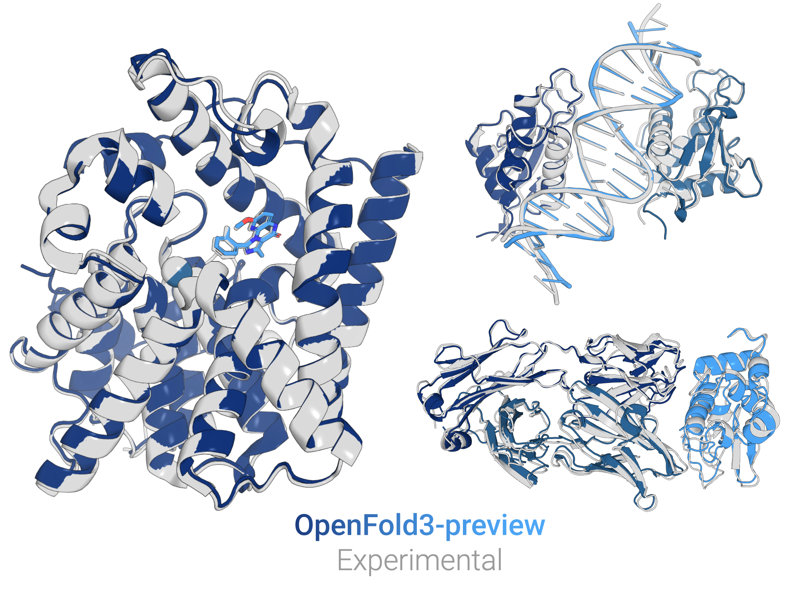

# OpenFold3-preview
<picture>
  <source media="(prefers-color-scheme: dark)" srcset="assets/predictions_combined_dark.png">
  <source media="(prefers-color-scheme: light)" srcset="assets/predictions_combined_light.png">
  
</picture>

OpenFold3-preview is a biomolecular structure prediction model aiming to be a bitwise reproduction of DeepMind's 
[AlphaFold3](https://github.com/deepmind/alphafold3), developed by the AlQuraishi Lab at Columbia University and the OpenFold consortium. This research preview is intended to gather community feedback and allow developers to start building on top of the OpenFold ecosystem. The OpenFold project is committed to long-term maintenance and open source support, and our repository is freely available for academic and commercial use under the Apache 2.0 license.

For our reproduction of AlphaFold2, please refer to the original [OpenFold repository](https://github.com/aqlaboratory/openfold).

## Technical report
A technical description of our most recent model version, OpenFold3-preview2, is available [here](https://portal.openfold.omsf.io/reports/of3p2_technical_report.pdf).

## Documentation
Please visit our [portal](https://portal.openfold.omsf.io/reports/of3p2_technical_report.pdf) and [full documentation](https://openfold-3.readthedocs.io/en/latest/) for instructions on running model training and inference.

## Datasets
We provide the full training data for reproducing OpenFold3-preview, including our reproduction of the MGnify-based 13M-sequence distillation dataset described in the AlphaFold3 paper. For more details about dataset access, please refer to [our portal](https://portal.openfold.omsf.io/datasets).

## Features

OpenFold3-preview replicates the input features described in the [AlphaFold3](https://www.nature.com/articles/s41586-024-07487-w) publication, as well as batch job support and efficient kernel-accelerated inference.

A summary of our supported features includes:
- Structure prediction of standard and non-canonical protein, RNA, and DNA chains, and small molecules
- Pipelines for generating MSAs using the [ColabFold server](https://github.com/sokrypton/ColabFold) or using JackHMMER / hhblits following the AlphaFold3 protocol
- [Structure templates](https://openfold-3.readthedocs.io/en/latest/template_how_to.html) for protein monomers
- Kernel acceleration through [cuEquivariance](https://docs.nvidia.com/cuda/cuequivariance) and [DeepSpeed4Science](https://www.deepspeed.ai/tutorials/ds4sci_evoformerattention/) kernels - more details [here](https://openfold-3.readthedocs.io/en/latest/kernels.html)
- Support for [multi-query jobs](https://openfold-3.readthedocs.io/en/latest/input_format.html) with [distributed predictions across multiple GPUs](https://openfold-3.readthedocs.io/en/latest/inference.html#inference-run-on-multiple-gpus)
- Custom settings for [memory constrained GPU resources](https://openfold-3.readthedocs.io/en/latest/inference.html#inference-low-memory-mode)
- [Training data processing](https://openfold-3.readthedocs.io/en/latest/data_pipeline_reference.html) and [model training](https://openfold-3.readthedocs.io/en/latest/training.html)

## Quick-Start for Inference

Make your first predictions with OpenFold3-preview in a few easy steps:


1. Install OpenFold3-preview using our pip package
```bash
pip install openfold3 
```

2. Setup your installation of OpenFold3-preview and download model parameters:
```bash
setup_openfold
```

3. Run your first prediction using the ColabFold MSA server with the `run_openfold` binary. It may also be necessary to [configure your environment variables](https://openfold-3.readthedocs.io/en/latest/Installation.html#environment-variables) depending on your system.  

```bash
run_openfold predict --query_json=examples/example_inference_inputs/query_ubiquitin.json
```

More information on how to customize your inference prediction can be found at our documentation home at https://openfold-3.readthedocs.io/en/latest/. More examples for inputs and outputs can be found in our [HuggingFace examples](https://huggingface.co/OpenFold/OpenFold3/tree/main/examples/common_examples).

## Benchmarking

**OpenFold3-preview-2 results:**
<picture>
  <source srcset="assets/of3p2-benchmarks-rnp.png">
  
</picture>
<picture>
  <source srcset="assets/of3p2-benchmarks-fb-interface.png">
  
</picture>
<picture>
  <source srcset="assets/of3p2-benchmarks-abag.png">
  
</picture>

Performance of OF3p2 and other models on a diverse set of benchmarks: 
- [Runs and Poses](https://www.biorxiv.org/content/10.1101/2025.02.03.636309v3) 
- [FoldBench](https://www.biorxiv.org/content/10.1101/2025.05.22.655600v1)
- [AF3 antibody-antigen set](https://www.nature.com/articles/s41586-024-07487-w)

For more details on inferences procedures and benchmarking methods, please refer to the [OpenFold3 Preview 2 whitepaper](https://portal.openfold.omsf.io/reports/of3p2_technical_report.pdf)

**OpenFold3-preview results:**

OpenFold3-preview performs competitively with the state of the art in open source biomolecular structure prediction, while being the only model to match AlphaFold3's performance on monomeric RNA structures.

Performance of OF3p and other models on a diverse set of benchmarks:
- Protein and RNA monomers from [CASP16](https://www.biorxiv.org/content/10.1101/2025.05.06.652459v2) and [Ludaic et al](https://www.biorxiv.org/content/10.1101/2025.04.30.651414v2)
- Protein-protein complexes from [CASP16](https://www.biorxiv.org/content/10.1101/2025.05.29.656875v1) and [FoldBench](https://www.biorxiv.org/content/10.1101/2025.05.22.655600v1) 
- Protein-ligand complexes from the [Runs and Poses](https://www.biorxiv.org/content/10.1101/2025.02.03.636309v3) 

For more details on inferences procedures and benchmarking methods, please refer to the [OpenFold3 Preview whitepaper](assets/of3p1_technical_report.pdf).

## Upcoming
The final OpenFold3 model is still in development, and we are actively working on the following features:
- Full parity on all modalities with AlphaFold3
- Workflows for training on custom non-PDB data

## Community

If you encounter problems using OpenFold3-preview, feel free to create an issue! We also
welcome pull requests from the community.

In addition, we offer a [public Slack channel](https://join.slack.com/share/enQtMTA2ODc5MzU5NjYxNzktY2FjMjg5Y2NhNTJmMzExODIyNzkxNTZiMGYzZGVmOTY1ZDEyMWZiZTRjN2U1YTNlNjkxN2YyZDdlNzFmMGRiZQ) for discussions and questions around OpenFold3.

## Citing this Work

If you use OpenFold3-preview in your research, please cite the following:

```
@software{openfold3-preview,
  title = {OpenFold3-preview},
  author = {{The OpenFold3 Team}},
  year = {2025},
  version = {0.4.0},
  doi = {10.5281/zenodo.19001000},
  url = {https://github.com/aqlaboratory/openfold-3},
  abstract = {OpenFold3-preview is a biomolecular structure prediction model aiming to be a bitwise reproduction of DeepMind's AlphaFold3, developed by the AlQuraishi Lab at Columbia University and the OpenFold consortium.}
}
```

Any work that cites OpenFold3-preview should also cite [AlphaFold3](https://www.nature.com/articles/s41586-024-07487-w).
